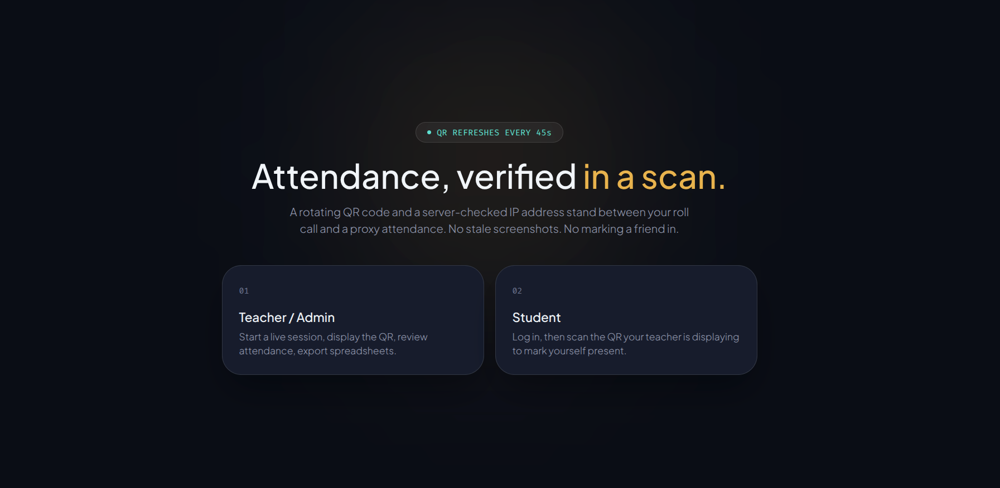

# AttendQR
----



-----

> A modern QR-based attendance management system built with **Next.js**, **Neon PostgreSQL**, and **Drizzle ORM**. AttendQR uses rotating QR codes, secure JWT authentication, and intelligent IP-based proxy detection to provide a reliable attendance solution for educational institutions.

---

## 🔗 Live Demo

**Visit:** https://attendqr-app-git-main-code-web-d32c7317.vercel.app/

---

# 📖 Table of Contents

- [AttendQR](#attendqr)
  - [🔗 Live Demo](#-live-demo)
- [📖 Table of Contents](#-table-of-contents)
- [📌 Overview](#-overview)
- [✨ Features](#-features)
- [🛠 Technology Stack](#-technology-stack)
- [⚙️ How It Works](#️-how-it-works)
  - [1. Rotating QR Codes](#1-rotating-qr-codes)
  - [2. Proxy \& Duplicate Device Detection](#2-proxy--duplicate-device-detection)
  - [3. Authentication](#3-authentication)
  - [4. Attendance Export](#4-attendance-export)
    - [Present Students](#present-students)
    - [Absent Students](#absent-students)
- [📂 Project Structure](#-project-structure)
- [🚀 Getting Started](#-getting-started)
  - [Prerequisites](#prerequisites)
- [🔐 Environment Variables](#-environment-variables)
- [📦 Installation](#-installation)
- [🌍 Deployment](#-deployment)
- [🔤 Fonts](#-fonts)
    - [Plus Jakarta Sans](#plus-jakarta-sans)
    - [Fira Code](#fira-code)
- [⚠️ Known Trade-offs](#️-known-trade-offs)
    - [Duplicate IP Detection](#duplicate-ip-detection)
    - [Default Student Password](#default-student-password)
- [🛠 Troubleshooting](#-troubleshooting)
  - [Invalid Email or Password](#invalid-email-or-password)
  - [`/admin` Errors After Login](#admin-errors-after-login)
- [📄 License](#-license)
  - [👨‍💻 Author](#-author)

---

# 📌 Overview

AttendQR is a secure QR-code attendance tracking application designed for colleges, schools, and training institutes.

Instead of generating one static QR code for an entire lecture, AttendQR creates a **time-limited QR code** that automatically rotates every **45–60 seconds**. Each QR contains a signed JWT token that expires automatically, preventing students from using screenshots or previously captured QR codes.

The application also records the client's IP address server-side and highlights suspicious duplicate IP usage in exported attendance reports.

---

# ✨ Features

- 🔐 Separate authentication for Teachers and Students
- 📱 Rotating QR Codes (45–60 seconds)
- ⏳ JWT-based QR expiration
- 📷 QR Code Scanner
- 🌐 Server-side IP address capture
- 🚩 Duplicate IP detection
- 📊 Excel attendance export
- 🟨 Duplicate IP highlighting in Excel
- 👨‍🏫 Teacher Dashboard
- 🎓 Student Dashboard
- 📅 Attendance by Session
- 📁 Built using Next.js App Router (No `src/` folder)
- ⚡ Neon PostgreSQL Database
- 🛡️ Drizzle ORM
- 🍪 Cookie-based JWT Authentication

---

# 🛠 Technology Stack

| Category | Technology |
|----------|------------|
| Framework | Next.js (App Router) |
| Language | TypeScript |
| Database | Neon PostgreSQL |
| ORM | Drizzle ORM |
| Authentication | Custom JWT |
| QR Generation | Signed JWT Tokens |
| Excel Export | ExcelJS |
| Styling | Tailwind CSS |
| Fonts | Plus Jakarta Sans, Fira Code |

---

# ⚙️ How It Works

## 1. Rotating QR Codes

**Files**

- `lib/qr-token.ts`
- `app/api/sessions/[id]/token/route.ts`

A teacher creates an attendance session.

The `LiveQRDisplay` component continuously polls:

```text
/api/sessions/:id/token
```

approximately every:

```text
QR_ROTATE_SECONDS - 3
```

seconds.

Each request generates a brand-new signed JWT:

```json
{
  "sessionId": "...",
  "exp": "..."
}
```

The token is immediately converted into a QR Code pointing to:

```text
/scan?token=...
```

The token is verified using:

```ts
jose.jwtVerify(...)
```

Once the expiration time (`exp`) is reached, the QR becomes invalid automatically.

This ensures:

- Screenshots cannot be reused
- Shared QR images expire automatically
- Replay attacks are prevented

---

## 2. Proxy & Duplicate Device Detection

**Files**

- `lib/get-ip.ts`
- `app/api/attendance/mark`
- `app/api/export`

When a student scans the QR code, the server records the client's IP using:

- `x-forwarded-for`
- `cf-connecting-ip`
- `x-real-ip`

The client never provides the IP directly.

Attendance is **never blocked** solely because multiple students share the same IP.

Instead, duplicate IP addresses are flagged and:

- displayed on the teacher dashboard
- highlighted **yellow** in exported Excel files

---

## 3. Authentication

**Files**

- `lib/auth.ts`
- `middleware.ts`

AttendQR uses two independent JWT cookies:

- `teacher_token`
- `student_token`

Authentication is validated in:

- Middleware (Edge Runtime)
- Server Components
- API Route Handlers

There is **no public registration**.

Teacher accounts are created using:

```text
scripts/seed-admin.ts
```

Students are managed directly through the Admin Dashboard.

---

## 4. Attendance Export

**File**

```text
app/api/export/route.ts
```

Teachers can export attendance for a selected date.

The generated Excel file includes:

### Present Students

- Roll Number
- Name
- Subject
- Attendance Time
- IP Address

### Absent Students

Students who did not attend the session.

Rows with duplicate IP addresses are automatically highlighted **yellow**.

---

# 📂 Project Structure

```text
app/
│
├── admin/              Teacher Dashboard
├── student/            Student Dashboard
├── scan/               QR Scanner
├── login/              Teacher & Student Login
├── api/                API Routes
│
components/
│   ├── LiveQRDisplay
│   ├── QRScanner
│   └── UI Components
│
lib/
│   ├── auth.ts
│   ├── db.ts
│   ├── get-ip.ts
│   ├── qr-token.ts
│   ├── schema.ts
│   └── session helpers
│
scripts/
│   └── seed-admin.ts
│
middleware.ts
```

---

# 🚀 Getting Started

## Prerequisites

- Node.js 20+
- npm
- Neon PostgreSQL Database

---

# 🔐 Environment Variables

Copy:

```bash
cp .env.example .env.local
```

Configure:

```env
DATABASE_URL=

AUTH_SECRET=

QR_SECRET=

NEXT_PUBLIC_APP_URL=

QR_ROTATE_SECONDS=45

SEED_TEACHER_NAME=

SEED_TEACHER_EMAIL=

SEED_TEACHER_PASSWORD=
```

Generate secure secrets:

```bash
openssl rand -base64 48
openssl rand -base64 48
```

---

# 📦 Installation

Install dependencies:

```bash
npm install
```

Generate database migration files:

```bash
npm run db:generate
```

Run migrations:

```bash
npm run db:migrate
```

Seed the teacher account:

```bash
npm run seed:admin
```

Start the development server:

```bash
npm run dev
```

Open:

```text
http://localhost:3000
```

---

# 🌍 Deployment

Deploy the project on **Vercel**.

Configure the same environment variables used locally.

Update:

```env
NEXT_PUBLIC_APP_URL=https://your-domain.vercel.app
```

Camera access for:

```text
/scan
```

requires HTTPS, which Vercel provides automatically.

---

# 🔤 Fonts

AttendQR uses:

### Plus Jakarta Sans

Used for:

- Body text
- Headings
- Dashboard UI

### Fira Code

Used for:

- Roll Numbers
- Countdown Timers
- IP Addresses
- Session Codes

Fonts are loaded using:

```text
next/font/google
```

Configuration files:

- `app/layout.tsx`
- `tailwind.config.ts`
- `app/globals.css`

---

# ⚠️ Known Trade-offs

### Duplicate IP Detection

IP matching is intended as a **signal**, not definitive proof of proxy attendance.

Students connected to the same classroom Wi-Fi may legitimately share the same public IP address.

Therefore:

- Attendance is never automatically rejected.
- Duplicate IPs are highlighted for teacher review.

---

### Default Student Password

The default password is the student's roll number.

For production deployments, it is recommended to implement:

- Password change functionality
- Password reset
- Email verification (optional)

---

# 🛠 Troubleshooting

## Invalid Email or Password

Run:

```bash
npm run seed:admin
```

The script prints the seeded credentials.

If environment variables are missing, the application falls back to:

```text
Email:
admin@school.edu

Password:
change-this-password
```

Update your `.env.local`, then rerun:

```bash
npm run seed:admin
```

The existing teacher account is updated instead of creating duplicates.

---

## `/admin` Errors After Login

If login succeeds but `/admin` immediately fails:

Verify that `lib/auth.ts` contains only Edge-compatible code.

Node-only dependencies should **not** be imported there.

For example:

- ✅ JWT verification
- ✅ Cookie parsing

Move password hashing into:

```text
lib/password.ts
```

using:

```text
bcryptjs
```

This keeps the Edge Runtime compatible.

---

# 📄 License

This project is intended for educational and learning purposes. Modify and extend it according to your institutional requirements.

---

## 👨‍💻 Author

Developed as a modern QR-based attendance tracking system using **Next.js**, **Neon PostgreSQL**, and **Drizzle ORM**.